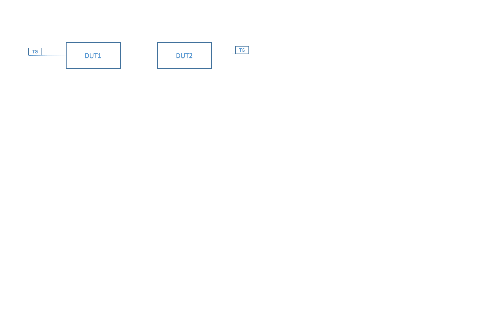

#  SQA Test Plan
# SONiC force mgmt route
# SONiC 3.4.2 Release
[TOC]
# Test Plan Revision History
| Rev | Date | Author | Change Description |
|:---:|:-----------:|:------------------:|-----------------------------|
| 0.1 | 01/19/2022 | Pavan Kumar Kasula | Initial version |

# List of Reviewers
|  Function | Name |
|:---:|:-----------:|
|  |   |

# List of Approvers
|  Function | Name | Date Approved|
|:---:|:-----------:|:------------------:|
|  |   |  |

# Definition/Abbreviation
| **Term** | **Meaning**                     |
| -------- | ------------------------------- |
|      |        |

# Introduction
# Objective
This document provides functional and design information about Force management routes.

# Scope
    Only forced_mgmt_routes add/del is covered
# Feature Overview
   ## VLAN
	forced_mgmt_routes attribute can be used to specify addresses / prefixes traffic to which are forced to go through management network instead of data network.
# 1 Test Focus Areas
## 1.1 Functional Testing 
			Enable/disable VLAN and Loopback interfaces via gNMI, REST or KLISH CLI.
			Provide management framework capability to handle admin state configuration for VLAN & Loopback interfaces.
			To administratively bring the VLAN and Loopback interface down, use "shutdown" command.
			To return the interface to its default admin state, use "no shutdown".
			The above configurations should be displayed as part of a show command.

# 2 Topologies
## 2.1 Topology 1

# 3 Test  Case and Objectives
## 3.1 Functional
### 3.1.1 To add v4 routes in config_db.json under mgmt interface and load the config file and verify routes present in kernel
| **Test ID**    | **Force_mgmt_route_func_001**                                |
| -------------- | :----------------------------------------------------------- |
| **Test Name**  | **Test to add v4 routes in config_db.json under mgmt interface and load the config file and verify routes present in kernel** |
| **Test Setup** | **Topology1**                                                |
| **Type**       | **Functional**                                               |
| **Steps**      | **1. Add v4(example: 10.145.225.103/32) routes under forced_mgmt_routes in config_db.json file  2. Load the config_db.json file   3. Verify that routes are present in kernel** |

### 3.1.2 Test to delete v4 routes in config_db.json under mgmt interface and load the config file and verify routes should delete in kernel
| **Test ID**    | **Force_mgmt_route_func_002**                                |
| -------------- | :----------------------------------------------------------- |
| **Test Name**  | **Test to delete v4 routes in config_db.json under mgmt interface and load the config file and verify routes should delete in kernel** |
| **Test Setup** | **Topology1**                                                |
| **Type**       | **Functional**                                               |
| **Steps**      | **1. Remove/Delete configured routes v4(example: 10.145.225.103/32) routes under forced_mgmt_routes in config_db.json file  2. Load the config_db.json file   3. Verify that routes should not present in kernel** |

### 3.1.3 To verify access to forced route from default vrf when mgmt vrf not configured
| **Test ID**    | **Force_mgmt_route_func_003**                                |
| -------------- | :----------------------------------------------------------- |
| **Test Name**  | **To verify access to forced route from default vrf when mgmt vrf not configured** |
| **Test Setup** | **Topology1**                                                |
| **Type**       | **Functional**                                               |
| **Steps**      | **1. Configure v4(taking LDAP server ip) route under force_mgmt_route table in config_db of dut1 2.  Make sure management interface under default-vrf in dut1 3. Verify ping to LDAP server should success ** |

### 3.1.4 To verify access to forced route when mgmt vrf configured

| **Test ID**    | **Force_mgmt_route_func_004**                                |
| -------------- | :----------------------------------------------------------- |
| **Test Name**  | **To verify access to forced route when mgmt vrf configured** |
| **Test Setup** | **Topology1**                                                |
| **Type**       | **Functional**                                               |
| **Steps**      | **1. Configure v4(taking LDAP server ip) route under force_mgmt_route table in config_db of dut1 2.  Configure mgmt vrf 3. Verify ping to LDAP server should success ** |

### 3.1.5 To verify access to forced route from default vrf to mgmt vrf 

| **Test ID**    | **Force_mgmt_route_func_005**                                |
| -------------- | :----------------------------------------------------------- |
| **Test Name**  | **To verify access to forced route from default vrf to mgmt vrf ** |
| **Test Setup** | **Topology1**                                                |
| **Type**       | **Functional**                                               |
| **Steps**      | **1. Add 64.0.0.2 and 2.1.1.1 routes under force_mgmt_route table in config_db of dut1 2.  configure  mgmt vrf in dut1 3. In dut1, Add ip address 64.0.0.1/24 under interface connected to dut2,  bind interface under mgmt vrf 4. In dut2 Add ip address 64.0.0.2/24 under interface connected to dut1 5. In dut2, configure loopback interface and assign 2.1.1.1/32 6. Verify ping to 64.0.0.2 from dut1  7. Verify Ping to 2.1.1.1 from dut1** |

| **Steps** | **1. Configure v4(taking LDAP server ip) route under force_mgmt_route table in config_db of dut1 2.  Configure mgmt vrf 3. Verify ping to LDAP server should success ** |
| --------- | :----------------------------------------------------------- |

### 3.1.6 To verify forward plane traffic when force_mgmt_routes configured 

| **Test ID**    | **Force_mgmt_route_func_006**                                |
| -------------- | :----------------------------------------------------------- |
| **Test Name**  | **To verify forward plane traffic when force_mgmt_routes configured ** |
| **Test Setup** | **Topology1**                                                |
| **Type**       | **Functional**                                               |
| **Steps**      | **1. Use Force_mgmt_route_func_005 configs 2.  Configure v4 address between tgen and dut1 connected port and dut2 to tgen 3. Add static route in dut1 to reach network configured between dut2 and tgen 4. Verify v4 traffic, normal forwarding should not effect** |

